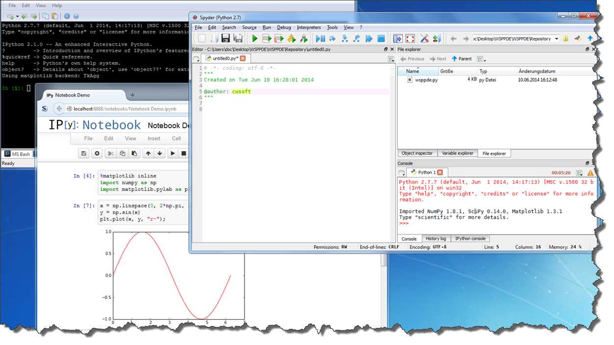

# WSPPDE - Windows&trade; Scientific Portable Python Development Environment
`WSPPDE` is a free portable Python development environment for MS Windows&trade; with focus on scientific applications. WSPPDE combines Python 2.7.6 (including the third party packages IPython, Matplotlib, NumPy, Pandas, SciPy) with the pre-configured Spyder2 IDE and an enhanced command console.

What `WSPPDE` is all about can best be seen from the screenshot below (older screenshot based on WSPPDE-2013-1):

Details about the third party software and Python packages distributed with WSPPDE can be found in the [Package list](PACKAGES.md). The history of the released WSPPDE installer packages is tracked via [Changelog](CHANGELOG.md). As GitHub [dropped support for binary downloads](https://github.com/blog/1302-goodbye-uploads) in December 2012, the last stable WSPPDE installation are now provided via the [download portale](http://www.heise.de/download/wsppde-1186495.html) of the German computer magazine c´t. In addition you can clone the make files from GitHub and build WSPPDE by your own.

## Installation
WSPPDE is distributed as a self-extracting Windows installer build with the open source tool [NSIS](http://nsis.sourceforge.net/Main_Page). WSPPDE was tested on MS Windows XP (32-bit) and Windows 7 (64-bit) operating system and should work out of the box. The required installation steps are explained below.

1. Download latest [WSPPDE installer](http://www.heise.de/download/wsppde-1186495.html) from the download portale of the German computer magazine c`t

2. Excecute the installer and unpack the files to the desired target directory

Note: All Software hosted on the download portale of the German computer magazine [c´t](http://www.heise.de/ct/) is scanned with multiple virus engines before beeing published.

## Usage
WSPPDE provides two convenient methods to start Python out of the box. 

### Spyder IDE
If you prefer to work with a powerfull integrated development environment (IDE), providing code highlighting and completion, debugging and an integrated help system, execute `Spyder-IDE.bat`. This launches the open source Python IDE [Spyder2](http://code.google.com/p/spyderlib/).

### Python/IPython Console
To install or update packages or write some quick tests, you may want to open the enhanced Windows command consolue by executing `Console.bat`. From here you can fire up the enhanced interactive Python shell [IPython](http://ipython.org/ipython-doc/stable/overview.html) by entering **ipython** to the console window. If you (for whatever reason) prefer the puristic Python standard shell, enter **python** instead. Alternatively you can use the shortcuts **CTRL+F2** (Python), **CTRL+F3** (IPython), **CTRL+F4** (Notebook) to launch the python application.

To install additional Python packages from the [Python Package index](https://pypi.python.org/pypi), open the enhanced Windows command line by excecuting `Console.bat`. To install the Python package [requests](https://pypi.python.org/pypi/requests) for example, enter the following command to the console.

	pip install requests

***Tip:*** Store your Python programs, modules or packages inside the WSPPDE folder *\Repository*. This folder is included to the Python search path, so files located here can be imported from the Python interpreter, IPython or the Spyder IDE. Details about the setup tools are shown when starting the tools with the flag `--help`.

### Excecuting Python programs
As WSPPDE is a portable Python version, the default Python filetypes (.py, pyw) are not associated with the Python interpreter by default.
Of course you can always excecute Python programs from the enhanced command console or the IDE, but there is a more convenient way to do it.
Just drag and drop a Python file (.py, pyw) on the `PyLauncher.bat` icon to execute it. 

By default packages located in the Python site-package folder or your local Repository folder are regognized and imported if required. In order to use Python files outside of these two pathes, add these pathes to the `Python\WSPPDE.pth` file. If you want, create a shortcut of the `PyLauncher.bat` and store it e.g. at your Desktop and pimp it with a new icon.

## Documentation
The links below provide further information about the software packages distributed with WSPPDE.

- [Python](http://docs.python.org/), [PyScripter](http://code.google.com/p/pyscripter/), [Console](http://sourceforge.net/projects/console/)
- [IPython](http://ipython.org/), [PyReadline](http://pypi.python.org/pypi/pyreadline), [pyzmq](http://www.zeromq.org/bindings:python), [Tornado](http://www.tornadoweb.org/)
- [Matplotlib](http://matplotlib.sourceforge.net/contents.html), [NumPy](http://docs.scipy.org/doc/), [SciPy](http://docs.scipy.org/doc/)
- [Pandas](http://code.google.com/p/pandas/)
- [Spyder](http://packages.python.org/spyder/)

## License
WSPPDE is released under [BSD License](http://www.opensource.org/licenses/bsd-license.php).  
Further details about the license terms of WSPPDE and the third party packages can be found in [LICENSE.md](LICENSE.md).